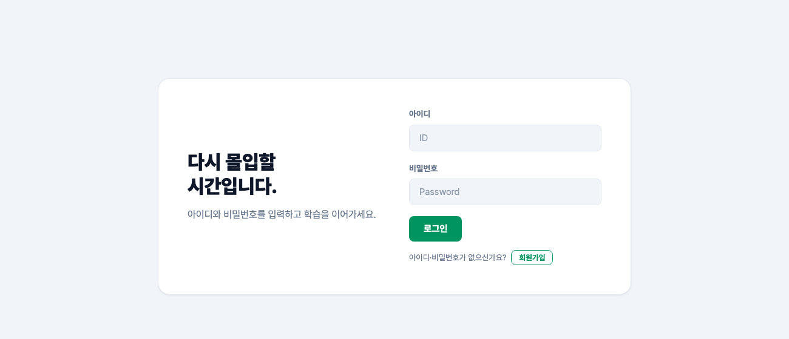

# HEXA FocusMate — IoT 기반 학습 집중도 모니터링 시스템

> 팀 캡스톤 프로젝트(6명)의 개인 보관용 복사본입니다. 원본 저장소: [TEAM-HEXA-3CPA/Capstone](https://github.com/TEAM-HEXA-3CPA/Capstone)

라즈베리파이 카메라로 학습자의 졸음·자리 이탈을 감지하고, AWS 클라우드로 실시간 전송해 **집중도 리포트와 스터디 그룹 랭킹**을 제공하는 서비스입니다.

| 항목 | 내용 |
|---|---|
| 유형 | 팀 캡스톤 프로젝트 (6명) |
| 기간 | 2026.05 ~ 2026.06 |
| 담당 | **AWS IoT Core 데이터 파이프라인 설계·구축, Aurora MySQL 클러스터 구축 및 DB 스키마 설계**, 웹 로그인·회원가입 화면 |
| 핵심 기술 | AWS IoT Core, AWS Lambda, Aurora MySQL Serverless v2, Amazon ECS, Docker, GitHub Actions |



---

## 1. 프로젝트 개요

온라인·자기주도 학습에서는 학습자가 스스로 집중 상태를 파악하기 어렵습니다. FocusMate는 카메라 영상에서 눈 감김 정도(EAR)와 자리 이탈을 감지해 집중도를 수치화하고, 스터디 그룹 단위로 공유해 학습 동기를 높이는 것을 목표로 합니다.

| 기능 | 내용 |
|---|---|
| 실시간 감지 | 라즈베리파이에서 YOLO · MediaPipe로 졸음(DROWSY)과 자리 이탈(AWAY) 감지 |
| 집중도 리포트 | 학습 세션별 평균 집중도, 졸음·이탈 횟수 |
| 스터디 그룹 · 랭킹 | 초대 코드로 그룹 참여, 누적 학습 시간 기반 랭킹 |

## 2. 아키텍처

```
[IoT 데이터 파이프라인]  ← 담당
  라즈베리파이 (카메라 · EAR 측정)
      │  MQTT over TLS (X.509 상호 인증)
      ▼
  AWS IoT Core ── 토픽 룰: SELECT ear, user_id FROM 'sensor/ear/data'
      ▼
  AWS Lambda (집중도 판단)
      ▼
  Aurora MySQL Serverless v2  ← 담당 (클러스터 구축 · 스키마 설계)
      ▲
[웹 서비스]
  사용자 → ALB → Amazon ECS (Nginx 컨테이너 · Flask 컨테이너)

[배포]
  GitHub Actions → Docker 빌드 → Amazon ECR → ECS 서비스 갱신
```

## 3. 나의 역할과 기여

### ① IoT 데이터 파이프라인 설계·구축 (AWS IoT Core)

라즈베리파이에서 측정한 데이터가 클라우드까지 안전하게 전달되는 실시간 경로를 담당했습니다.

| 구현 | 설계 근거 |
|---|---|
| 디바이스 3대를 Thing으로 등록하고 **X.509 인증서 기반 상호 인증(mTLS)** 적용 | 인증서가 없는 기기의 위장 접속 차단 |
| IoT 정책에 **Connect · Publish · Subscribe · Receive 4가지 동작만 허용**, 토픽을 하나로 한정 | 최소 권한 원칙 — 기기가 탈취돼도 다른 토픽 접근 불가 |
| 토픽 룰에서 **SQL로 필요한 필드(ear, user_id)만 추출**해 Lambda 호출 | 전달 데이터를 줄여 Lambda 처리 비용과 복잡도 감소 |
| IoT Core → Lambda 직접 연동 (중간 큐 없음) | 이벤트 기반 구조로 지연 최소화 |

### ② 데이터베이스 구축 및 스키마 설계 (Aurora MySQL)

| 구현 | 설계 근거 |
|---|---|
| **Aurora Serverless v2** 클러스터 구축 (0 ~ 4 ACU, 유휴 5분 후 자동 일시정지) | 사용량이 불규칙한 개발 단계에서 유휴 시간 과금 최소화, 요청 시 자동 확장 |
| Writer · Reader 인스턴스 분리, KMS 암호화, 7일 자동 백업 | 읽기 부하 분산, 저장 데이터 보호, 복구 가능성 확보 |
| 서비스 전반을 다루는 **8개 테이블 스키마 설계** | 요구사항 분석 기반 정규화, 감사·운영 이력까지 고려 |
| PK · FK · UNIQUE · ENUM 등 제약조건 적용 | 데이터 정합성을 DB 단에서 보장해 애플리케이션 검증 부담 감소 |

**테이블 구성**

| 테이블 | 역할 | 주요 제약 |
|---|---|---|
| users | 사용자 계정 | 아이디 · 전화번호 · 이메일 · 닉네임 UNIQUE |
| study_groups | 스터디 그룹 | 초대 코드 UNIQUE, 생성자 FK |
| group_members | 그룹-사용자 관계 | 그룹 · 사용자 FK |
| user_rankings | 집중도 랭킹 | 누적 학습 시간 UNSIGNED, 갱신 시각 자동 기록 |
| focus_summary_logs | 세션 요약 | 평균 집중도 · 졸음 · 이탈 횟수 |
| critical_event_logs | 이벤트 로그 | 이벤트 유형 ENUM('DROWSY', 'AWAY') |
| batch_execution_log | 배치 실행 이력 | 상태 ENUM('RUNNING', 'SUCCESS', 'FAILED') |
| user_deletion_audit | 계정 삭제 감사 | 삭제 시각 · 사유 |

### ③ 데이터 흐름 검증

데이터가 저장되는지만 확인하지 않고, 파이프라인 구간마다 값이 의도대로 흐르는지 따라가며 점검했습니다. 그 과정에서 **외래 키 방향과 데이터 타입이 어긋나 값이 꼬이는 문제**를 여러 차례 발견해 수정했습니다.

### ④ 웹 로그인 · 회원가입 화면

로그인 화면을 우선 표시하고 회원가입으로 전환되는 흐름을 구현했습니다 (`web/index.html`).

## 4. 기술 스택

| 영역 | 기술 |
|---|---|
| Edge · AI | Raspberry Pi, Python, OpenCV, YOLO, MediaPipe, MQTT |
| IoT · 데이터 | AWS IoT Core, AWS Lambda, Aurora MySQL Serverless v2 |
| 웹 서비스 | Flask, HTML / CSS / JavaScript, Nginx |
| 인프라 · 배포 | Docker, Amazon ECS · ECR, ALB, AWS Secrets Manager, GitHub Actions |

## 5. 저장소 구조

```
backend/            Flask API (인증, 그룹, 랭킹, 리포트)
web/                프론트엔드 (Nginx), 로그인 · 대시보드 · 리포트 화면
drowsiness_yolo_mqtt.py   엣지 디바이스 졸음 감지 및 MQTT 발행
compose.yml         로컬 실행용 Docker Compose
.github/workflows/  CI (Compose 검증), CD (ECR 빌드 · ECS 배포)
docs/               인프라 설계 문서, 원본 README
```

## 6. 문서

- [AWS 인프라 설계](docs/AWS_인프라_설계.md) — IoT Core · Aurora 구성 상세와 설계 근거
- [원본 팀 README](docs/ORIGINAL_README.md)

> 이 저장소는 개인 포트폴리오 보관용 복사본으로, GitHub Actions는 비활성화되어 있습니다.
